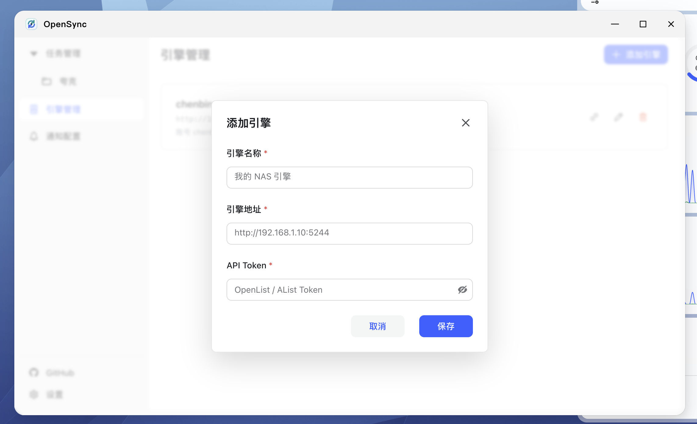
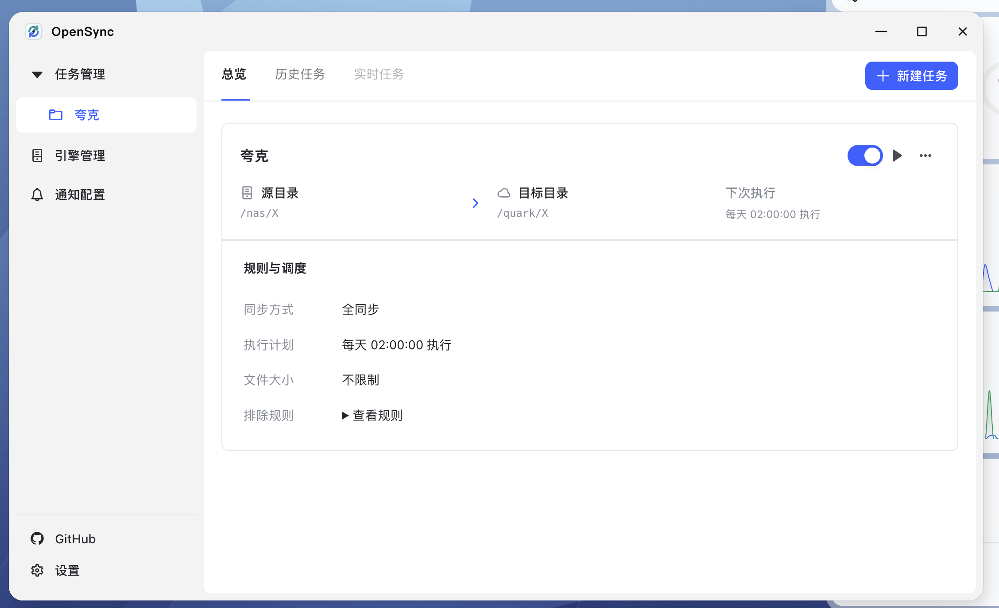
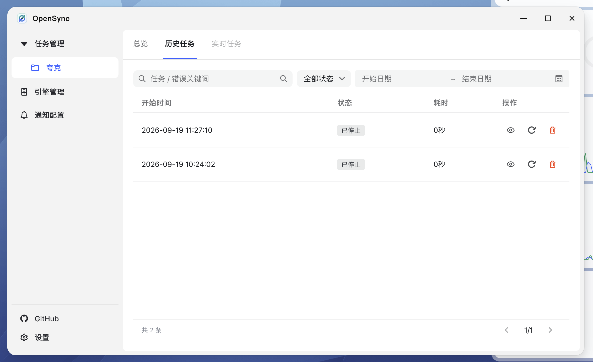
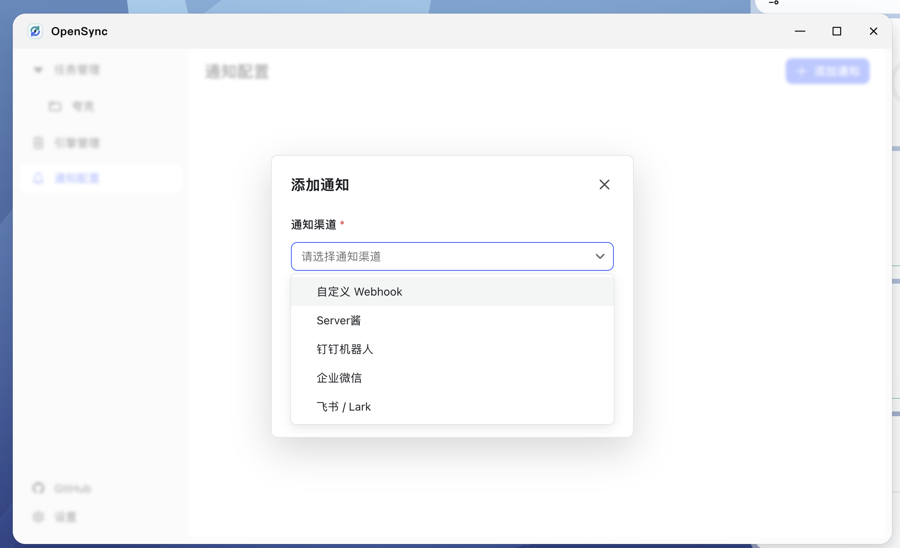
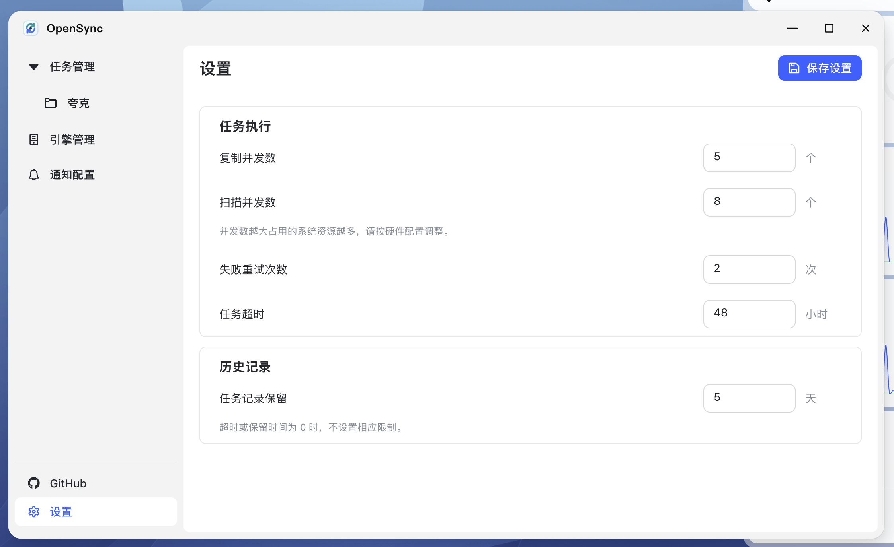

# OpenSync

飞牛下的群晖 Cloud Sync 平替方案。

依赖 [OpenList](https://github.com/OpenListTeam/OpenList)（兼容 AList）作为存储引擎 — 在 OpenList 中添加本地存储和各类云盘（阿里云盘、百度网盘、OneDrive、S3、WebDAV 等）后，即可通过 OpenSync 在不同存储之间自动定期备份与同步文件。

当前版本：**v0.0.18**

## 功能

- **存储引擎管理** — 添加、编辑、测试 AList / OpenList 引擎连接
- **同步任务** — 两种同步模式：
  - 增量同步：持续备份，不删除目标端多余文件
  - 全量同步：目标与源完全一致，自动清理多余文件，相同内容优先复用避免重传
- **灵活调度** — 固定间隔、Cron 表达式、仅手动触发
- **文件过滤** — gitignore 格式排除规则 + 文件大小范围限制
- **实时任务** — 查看当前任务快照，按状态和分页定期刷新逐文件明细，支持失败后手动重试
- **执行历史** — 分页查看历史任务，按状态 / 类型 / 关键词筛选
- **多渠道通知** — Webhook、Server酱、钉钉、企业微信、飞书
- **系统设置** — 并发数、重试次数、超时时间、历史记录保留天数

## 使用方式

### 1. 安装

在 [GitHub Releases](https://github.com/chenbin3625/OpenSync-fnOS/releases) 下载与你设备架构匹配的 `.fpk` 包，在飞牛 NAS 应用管理界面安装，安装完成后在应用列表中打开。

- x86 / amd64：`opensync-amd64.fpk`
- ARM / arm64：`opensync-arm64.fpk`

可使用发布页附带的 `SHA256SUMS` 校验安装包：

```bash
shasum -a 256 -c SHA256SUMS
```

### 2. 添加存储引擎

进入「引擎管理」页面，点击「添加引擎」，填写 OpenList / AList 的地址和 API Token。添加后可点击「测试引擎」验证连接是否正常。



### 3. 创建同步任务

进入「任务管理」页面，点击「新建任务」，按步骤配置：

1. **引擎与路径** — 选择存储引擎，指定源目录和目标目录
2. **同步与调度** — 选择同步模式（增量同步 / 全量同步），设置执行计划（定时间隔、Cron 表达式或仅手动）
3. **文件过滤** — 按需设置文件大小限制和排除规则（gitignore 格式，已内置常见系统文件排除）

### 4. 查看执行状态

任务创建后可在「任务管理」页面查看执行状态：

**总览** — 查看任务配置摘要，手动触发执行、暂停或编辑任务



**实时任务** — 查看当前正在执行的同步进度，包括传输速度、已完成大小、运行时间和逐文件状态。任务快照和当前明细页会定期刷新，切换状态或分页时立即加载对应视图


**历史任务** — 按时间范围、状态、关键词筛选历史执行记录，点击查看每次执行的文件明细



### 5. 配置通知（可选）

进入「通知配置」页面，添加通知渠道（Webhook、Server酱、钉钉、企业微信或飞书），任务执行完成后自动推送结果通知。



### 6. 系统设置

进入「设置」页面，按需调整任务执行参数：复制并发数、扫描并发数、失败重试次数、任务超时时间和历史记录保留天数。



## 技术栈

- 前端：React 19 + TypeScript + Vite + Semi Design
- 后端：Go + Gin + SQLite
- 调度：robfig/cron
- 打包：fnOS Native App

## 本地开发

```bash
npm run dev
```

默认启动 Go 后端和 Vite 前端，前端请求真实后端接口。

只调试前端时可以使用内置 mock 接口：

```bash
npm run dev:mock
```

mock 模式由 `frontend/.env.mock` 中的 `VITE_DATA_MODE=mock` 显式开启，请求会通过 MSW 拦截并使用内存数据；普通开发和生产构建不会自动启用 mock。

## 许可证

[MIT](LICENSE)
